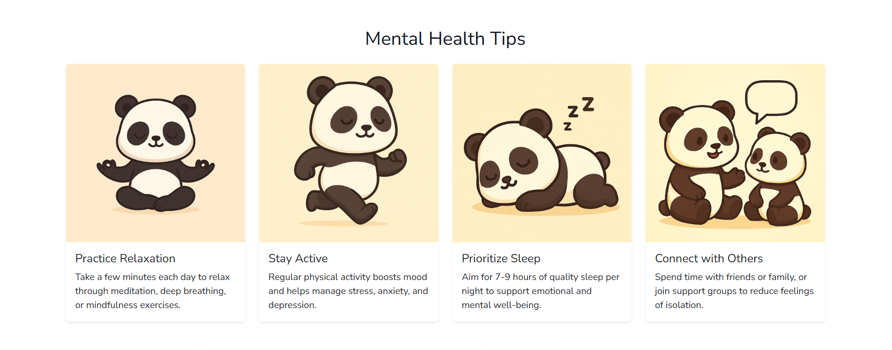
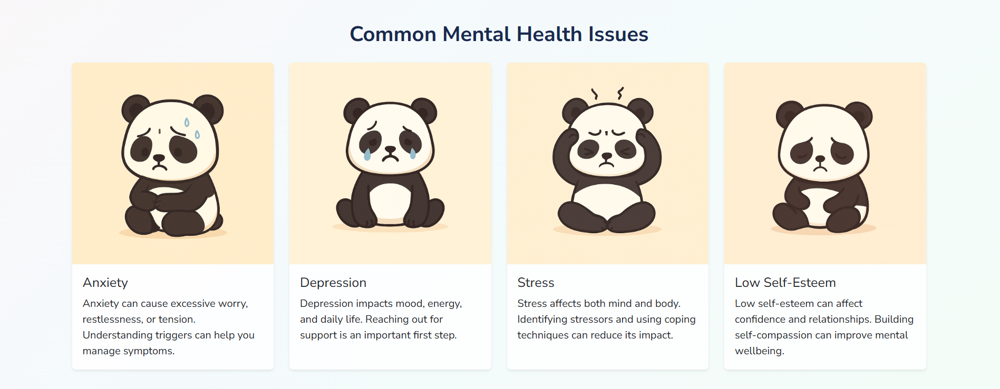
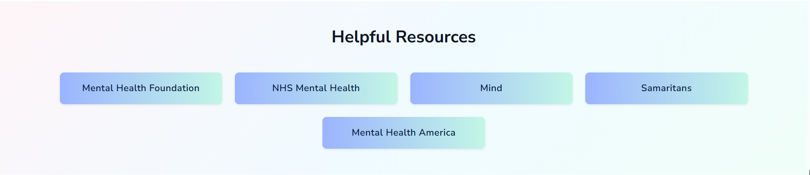

# Mental Health Awareness Website

## Project Purpose
The **Mental Health Awareness Website** is a one-page, interactive web application designed to provide **accessible, beginner-friendly information on mental health**. The goal is to create a **welcoming and supportive environment** where users can learn about common mental health issues, stress management techniques, and access reliable resources for further support.

This project was developed as part of an individual formative assignment to demonstrate skills in **HTML, CSS, Bootstrap, accessibility, responsiveness, and cloud deployment**.

---

## User Value
- **Learn about mental health:** Users can understand common issues and stress management strategies.  
- **Access resources:** Provides links to external mental health support organisations.  
- **Positive encouragement:** Displays uplifting quotes and affirmations to support emotional wellbeing.  
- **Responsive design:** Works across desktop, tablet, and mobile devices.  
- **Accessibility focused:** Semantic HTML, alt text for images, and WCAG-compliant colour contrast.

---

## Features
1. **Hero Section:**  
   - Bootstrap Jumbotron with a positive, calming message.  
   - Simple background image and readable typography.

2. **Information Cards:**  
   - Bootstrap cards presenting mental health tips and common issues.  
   - Each card includes a title, description, and optional icon/image with alt text.

3. **Resource Links:**  
   - Grid layout with external links styled as Bootstrap buttons.  
   - Links open in a new tab for easy access.

4. **Positive Affirmations:**  
   - Section displaying motivational quotes using Bootstrap text utilities.  
   - Encourages users and supports mental wellbeing.

5. **Navigation:**  
   - Sticky top navigation menu for smooth scrolling to page sections.  
   - Intuitive layout for easy browsing.

---

## Deployment
The website is deployed on **[GitHub Pages](https://deanharland.github.io/mental-health-awareness/)**.
Deployment steps:
1. Ensure your project files are committed to a GitHub repository.
2. Go to **Settings → Pages** and select the branch containing `index.html`.
3. Save, and GitHub Pages will provide a live URL.
4. Verify all internal links, images, and resources function correctly.

---

## Screenshots
*(Replace these placeholders with your actual screenshots)*

**Hero Section**  

**Information Cards**  

**Resource Links**  

**Positive Affirmations**  

---

## Technologies Used
- **HTML5** – Semantic markup for structure and accessibility.  
- **CSS3** – Styling and layout adjustments.  
- **Bootstrap 5** – Responsive design and pre-built components (cards, buttons, grid).  
- **Git & GitHub** – Version control and cloud deployment.  
- **Optional AI Tools** – Assisted in code generation, debugging, and UX improvements.

---

## AI Tool Reflection
- **Code Creation:** AI helped generate reusable Bootstrap card structures and hero section layouts, saving time.  
- **Debugging:** Assisted in identifying responsive issues and HTML/CSS syntax errors.  
- **Performance & UX Optimization:** AI suggested efficient class usage and responsive design improvements to enhance accessibility and mobile experience.  
- **Workflow Impact:** AI tools improved productivity, helping focus on content and UX while reducing repetitive coding tasks.

---

## Attribution
- Any external code or templates adapted are properly referenced in the code comments.  
- Icons and images are sourced from free resources with proper licensing (e.g., Unsplash, Font Awesome).

---

## License
This project is for educational purposes. Attribution is provided for any external assets used.
